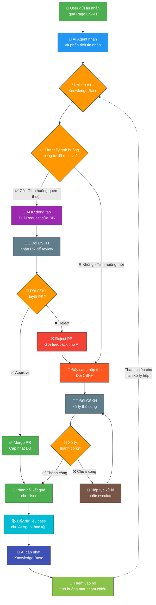

# Control Flow Graph - Quy trình CSKH với AI Agent

Sơ đồ dưới đây mô tả toàn bộ luồng xử lý từ khi **User gửi tin nhắn** đến khi vấn đề được giải quyết và AI Agent học hỏi.

## Tổng quan luồng xử lý

## Chi tiết từng bước

### 1. User gửi tin nhắn (A)
User truy cập **Page CSKH** và gửi tin nhắn mô tả vấn đề đang gặp phải.

### 2. AI Agent phân tích (B → C → D)
AI Agent nhận tin nhắn, sử dụng NLP để phân tích nội dung và tra cứu **Knowledge Base** — cơ sở dữ liệu các tình huống đã từng xử lý thành công.

### 3a. Tình huống quen thuộc (D → E → F → G)
Nếu AI phát hiện vấn đề **tương tự** một case đã resolve trước đó:
- AI **tự động tạo Pull Request** chứa các thay đổi DB cần thiết
- PR được gửi đến **đội CSKH** để review
- Nếu **Approve**: merge PR, cập nhật DB, phản hồi user
- Nếu **Reject**: chuyển sang xử lý thủ công (giống nhánh tình huống mới)

### 3b. Tình huống mới (D → J → K → L)
Nếu AI **không tìm thấy** tình huống tương tự:
- Tin nhắn được **đẩy sang hộp thư** đội CSKH
- Đội CSKH **xử lý thủ công**
- Nếu chưa xong, tiếp tục xử lý hoặc escalate

### 4. Feedback Loop - AI Học tập (N → O → P → Q)
Khi một case được xử lý thành công:
1. **Phản hồi** kết quả cho user
2. Đội CSKH **đẩy dữ liệu** case (vấn đề + giải pháp) cho AI Agent
3. AI **cập nhật Knowledge Base** với case mới
4. Case được thêm vào **bộ tình huống mẫu** để tham chiếu cho các lần xử lý tiếp theo

:::tip Vòng lặp cải tiến liên tục
Mỗi case được resolve thành công đều trở thành dữ liệu huấn luyện cho AI. Theo thời gian, AI sẽ tự động xử lý được nhiều tình huống hơn, giảm tải cho đội CSKH.
:::
