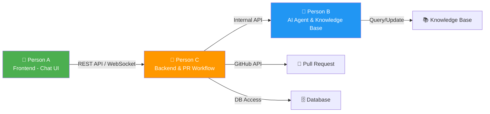
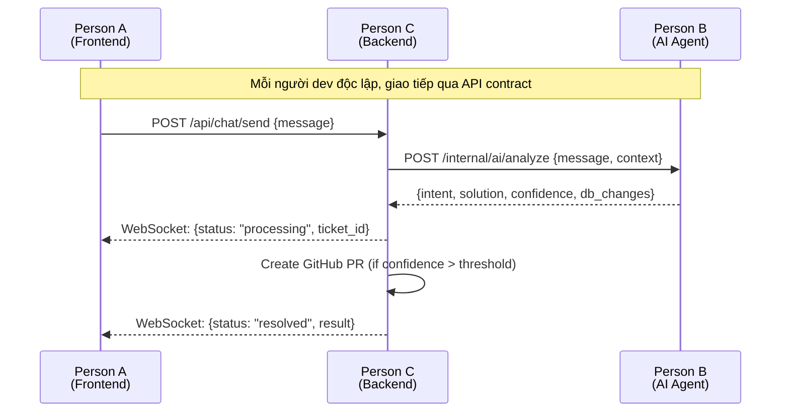

# Kanban Board - Phân chia công việc

Dự án được chia thành **3 module độc lập**, mỗi người phụ trách 1 module. Các module giao tiếp qua API contract đã thống nhất trước.

## Tổng quan phân chia

---

### 👤 Person A — Frontend (Chat UI)

#### 📋 Backlog

Design
<strong>Thiết kế UI/UX cho trang Chat</strong>

Wireframe + mockup giao diện chat giữa user và AI Agent. Responsive cho mobile & desktop.

Design
<strong>Thiết kế trang trạng thái xử lý</strong>

UI hiển thị tiến trình xử lý ticket: đang xử lý, chờ review, đã hoàn thành.

#### 🔨 To Do

Frontend
<strong>Xây dựng Chat Component</strong>

React component cho giao diện chat real-time. Hỗ trợ gửi/nhận tin nhắn, hiển thị typing indicator.

Frontend
<strong>Tích hợp WebSocket</strong>

Kết nối WebSocket tới Backend để nhận/gửi message real-time. Xử lý reconnect & error states.

Frontend
<strong>Hiển thị trạng thái ticket</strong>

Component hiển thị trạng thái xử lý: pending, in-progress, resolved. Polling hoặc subscribe qua WebSocket.

Frontend
<strong>Lịch sử hội thoại</strong>

Trang hiển thị lịch sử các cuộc chat trước đó của user. Hỗ trợ tìm kiếm & lọc.

Testing
<strong>Unit test & E2E test cho Frontend</strong>

Viết test cho các component chính. E2E test luồng chat hoàn chỉnh.

#### 🚀 In Progress

Chưa có task nào đang thực hiện

#### ✅ Done

Chưa có task nào hoàn thành

### 👤 Person B — AI Agent & Knowledge Base

#### 📋 Backlog

Research
<strong>Nghiên cứu LLM API phù hợp</strong>

So sánh OpenAI GPT vs Claude API vs local model. Đánh giá cost, latency, accuracy cho use case CSKH.

Research
<strong>Thiết kế cấu trúc Knowledge Base</strong>

Định nghĩa schema cho KB: categories, tags, embedding vectors, resolution steps. Chọn vector DB (Pinecone/Weaviate/ChromaDB).

#### 🔨 To Do

AI/ML
<strong>Xây dựng AI Agent core</strong>

Module xử lý tin nhắn user: intent classification, entity extraction, problem identification. Sử dụng LLM + prompt engineering.

AI/ML
<strong>Xây dựng hệ thống tra cứu KB</strong>

Semantic search trên Knowledge Base. Tìm case tương tự bằng embedding similarity. Trả về top-k matches + confidence score.

AI/ML
<strong>Xây dựng module đề xuất giải pháp</strong>

Dựa trên case tương tự từ KB, AI tự động generate giải pháp + DB change proposal. Output: structured JSON action plan.

AI/ML
<strong>Learning loop - Cập nhật KB</strong>

Module tự động học từ case đã resolve: extract pattern, update embeddings, thêm case mới vào KB.

Testing
<strong>Test AI accuracy & KB retrieval</strong>

Benchmark AI agent với bộ test cases. Đo accuracy, recall, latency. Regression test khi update KB.

#### 🚀 In Progress

Chưa có task nào đang thực hiện

#### ✅ Done

Chưa có task nào hoàn thành

### 👤 Person C — Backend & PR Workflow

#### 📋 Backlog

Infra
<strong>Thiết kế kiến trúc Backend</strong>

System design: API gateway, message queue, service layer. Chọn tech stack (Node.js/Python FastAPI). Database schema design.

Infra
<strong>Setup CI/CD & deployment</strong>

GitHub Actions pipeline: build, test, deploy. Docker containerization. Staging & production environment.

#### 🔨 To Do

Backend
<strong>API Gateway & WebSocket server</strong>

REST API cho chat operations. WebSocket server cho real-time messaging. Authentication & rate limiting.

Backend
<strong>Message queue & routing</strong>

Queue system (Redis/RabbitMQ) để route messages giữa Frontend → AI Agent. Đảm bảo message ordering & delivery.

Backend
<strong>Tự động tạo Pull Request</strong>

Tích hợp GitHub API: tạo branch, commit DB changes, tạo PR. Template PR với description chi tiết từ AI analysis.

Backend
<strong>PR webhook & merge handler</strong>

Lắng nghe GitHub webhook khi PR approved/merged. Trigger DB update & thông báo result cho user qua WebSocket.

Backend
<strong>Database operations layer</strong>

Secure DB access layer: chỉ thực hiện changes sau khi PR merged. Audit log mọi thay đổi. Rollback mechanism.

Testing
<strong>Integration test & load test</strong>

Test toàn bộ luồng end-to-end. Load test cho WebSocket connections & API throughput.

#### 🚀 In Progress

Chưa có task nào đang thực hiện

#### ✅ Done

Chưa có task nào hoàn thành

---

## API Contract giữa các module

Để 3 người có thể làm việc độc lập, các API contract được định nghĩa trước:

| Interface | From | To | Protocol | Mô tả |
|---|---|---|---|---|
| Chat API | Person A | Person C | REST + WebSocket | Gửi/nhận tin nhắn, trạng thái ticket |
| AI Processing API | Person C | Person B | Internal REST | Forward message tới AI, nhận analysis result |
| KB Query API | Person B | Knowledge Base | Internal | Tra cứu & cập nhật Knowledge Base |
| GitHub PR API | Person C | GitHub | GitHub REST API | Tạo/quản lý Pull Request |
| Webhook Handler | GitHub | Person C | Webhook | Nhận event khi PR approved/merged |

