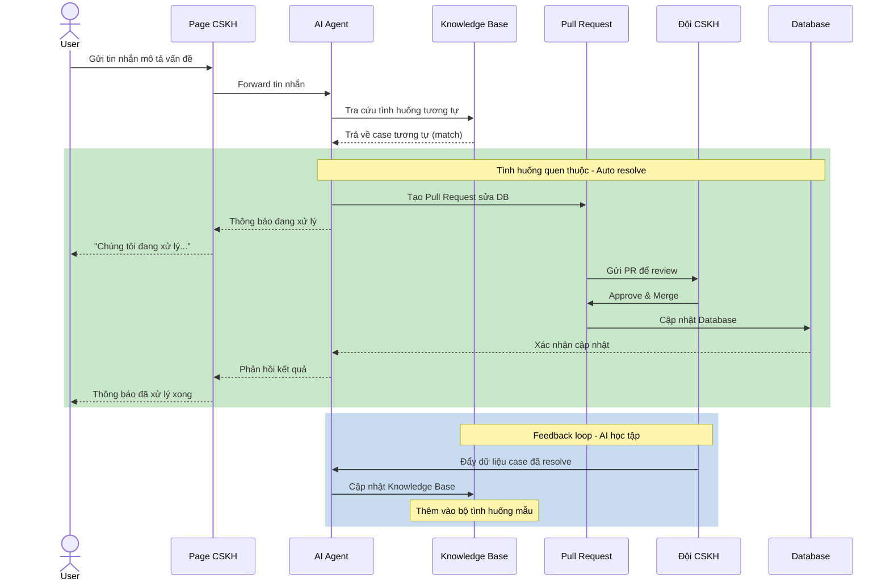
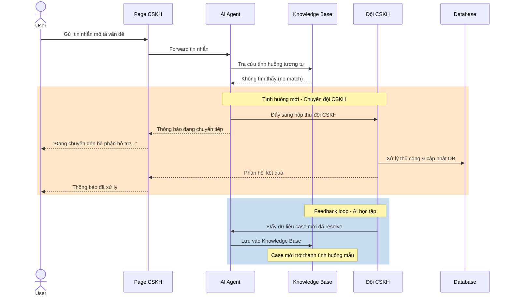

# Sequence Diagram - Tương tác giữa các thành phần

## Luồng xử lý tình huống đã biết (Auto-resolve)

```mermaid
sequenceDiagram
    actor User
    participant Page as Page CSKH
    participant AI as AI Agent
    participant KB as Knowledge Base
    participant PR as Pull Request
    participant CSKH as Đội CSKH
    participant DB as Database

    User->>Page: Gửi tin nhắn mô tả vấn đề
    Page->>AI: Forward tin nhắn
    AI->>KB: Tra cứu tình huống tương tự
    KB-->>AI: Trả về case tương tự (match)

    rect rgb(200, 230, 200)
        Note over AI,DB: Tình huống quen thuộc - Auto resolve
        AI->>PR: Tạo Pull Request sửa DB
        AI-->>Page: Thông báo đang xử lý
        Page-->>User: "Chúng tôi đang xử lý..."
        PR->>CSKH: Gửi PR để review
        CSKH->>PR: Approve & Merge
        PR->>DB: Cập nhật Database
        DB-->>AI: Xác nhận cập nhật
        AI-->>Page: Phản hồi kết quả
        Page-->>User: Thông báo đã xử lý xong
    end

    rect rgb(200, 220, 240)
        Note over CSKH,KB: Feedback loop - AI học tập
        CSKH->>AI: Đẩy dữ liệu case đã resolve
        AI->>KB: Cập nhật Knowledge Base
        Note over KB: Thêm vào bộ tình huống mẫu
    end
```

## Luồng xử lý tình huống mới (Manual)

```mermaid
sequenceDiagram
    actor User
    participant Page as Page CSKH
    participant AI as AI Agent
    participant KB as Knowledge Base
    participant CSKH as Đội CSKH
    participant DB as Database

    User->>Page: Gửi tin nhắn mô tả vấn đề
    Page->>AI: Forward tin nhắn
    AI->>KB: Tra cứu tình huống tương tự
    KB-->>AI: Không tìm thấy (no match)

    rect rgb(255, 230, 200)
        Note over AI,CSKH: Tình huống mới - Chuyển đội CSKH
        AI->>CSKH: Đẩy sang hộp thư đội CSKH
        AI-->>Page: Thông báo đang chuyển tiếp
        Page-->>User: "Đang chuyển đến bộ phận hỗ trợ..."
        CSKH->>DB: Xử lý thủ công & cập nhật DB
        CSKH-->>Page: Phản hồi kết quả
        Page-->>User: Thông báo đã xử lý
    end

    rect rgb(200, 220, 240)
        Note over CSKH,KB: Feedback loop - AI học tập
        CSKH->>AI: Đẩy dữ liệu case mới đã resolve
        AI->>KB: Lưu vào Knowledge Base
        Note over KB: Case mới trở thành tình huống mẫu
    end
```
