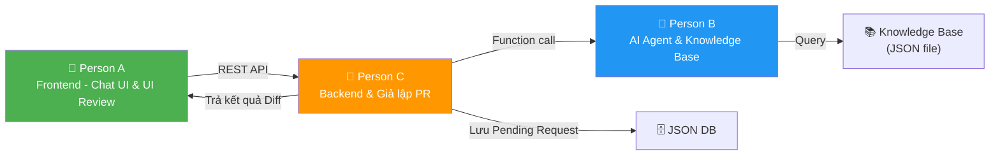
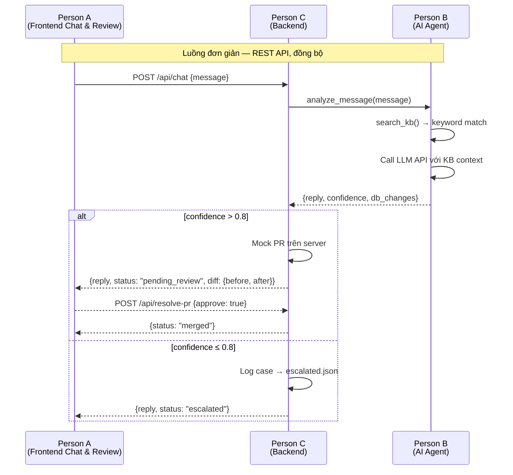

# Kanban Board - Phân chia công việc (Hackathon 1.5h)

:::tip Nguyên tắc tối giản
⏱️ **Chỉ có 1.5 giờ** — Mỗi người làm **3 task**, tổng **9 task**. Không WebSocket, không message queue, không CI/CD, không testing riêng. Chỉ REST API đơn giản, polling để cập nhật trạng thái.
:::

Dự án được chia thành **3 module độc lập**, mỗi người phụ trách 1 module. Các module giao tiếp qua API contract đã thống nhất trước.

## Tổng quan phân chia

---

### 👤 Person A — Frontend (Chat UI)

#### 🔨 To Do

Frontend
<strong>1. Chat UI cơ bản</strong>

React component: ô nhập tin nhắn + danh sách messages. Hiển thị bubble user (phải) và AI (trái). Dùng state đơn giản, không cần phức tạp.

<em>⏱️ ~40 phút</em>

Frontend
<strong>2. Gọi REST API gửi/nhận tin nhắn</strong>

<code>POST /api/chat</code> gửi message, nhận response từ AI. Hiển thị loading spinner khi chờ. Xử lý error cơ bản (try-catch, hiển thị thông báo lỗi).

<em>⏱️ ~25 phút</em>

Frontend
<strong>3. Giao diện UI Review (Giả lập PR)</strong>

Khi AI tự động resolve, hiển thị một giao diện giống như Git Diff để bộ phận CSKH review (Giả lập PR). Hiển thị giá trị DB DB <em>trước</em> và <em>sau</em> khi thay đổi, kèm nút Approve / Reject.

<em>⏱️ ~25 phút</em>

#### 🚀 In Progress

Chưa có task nào đang thực hiện

#### ✅ Done

Chưa có task nào hoàn thành

### 👤 Person B — AI Agent & Knowledge Base

#### 🔨 To Do

AI/ML
<strong>1. Chuẩn bị Knowledge Base (JSON)</strong>

Tạo file <code>knowledge_base.json</code> chứa 5-10 case mẫu. Mỗi case gồm: <code>keywords</code>, <code>problem</code>, <code>solution</code>, <code>db_changes</code>. Không cần vector DB — dùng keyword matching đơn giản.

<em>⏱️ ~20 phút</em>

AI/ML
<strong>2. AI Agent xử lý tin nhắn</strong>

Hàm <code>analyze_message(message)</code>: gọi LLM API (OpenAI/Claude) với prompt chứa context từ KB. Prompt yêu cầu LLM trả về JSON: <code>&#123;intent, matched_case, solution, confidence, db_changes&#125;</code>.

<em>⏱️ ~40 phút</em>

AI/ML
<strong>3. Tra cứu KB + format kết quả</strong>

Hàm <code>search_kb(message)</code>: tìm case tương tự bằng keyword matching. Truyền kết quả vào prompt LLM để AI đề xuất giải pháp chính xác hơn. Trả về structured response cho Backend.

<em>⏱️ ~30 phút</em>

#### 🚀 In Progress

Chưa có task nào đang thực hiện

#### ✅ Done

Chưa có task nào hoàn thành

### 👤 Person C — Backend & Giả lập PR

#### 🔨 To Do

Backend
<strong>1. REST API server</strong>

Setup Express.js hoặc FastAPI. Một endpoint <code>POST /api/chat</code> xử lý nhận message và endpoint phụ để quản lý trạng thái Diff: <code>POST /api/resolve-pr</code>. CORS enabled.

<em>⏱️ ~25 phút</em>

Backend
<strong>2. Xử lý logic Giả lập Pull Request</strong>

Khi AI trả về <code>confidence > 0.8</code> + có <code>db_changes</code>: thay vì dùng GitHub API, backend record mock PR vào file JSON và trả <code>before_value</code>, <code>after_value</code> ngược lại cho Frontend để Frontend render giao diện Review.

<em>⏱️ ~40 phút</em>

Backend
<strong>3. Xử lý case chuyển tiếp CSKH</strong>

Khi AI trả về <code>confidence ≤ 0.8</code> hoặc không match KB: trả response "đã chuyển đội CSKH". Ghi log case mới vào file JSON (thay cho DB) để demo luồng fallback.

<em>⏱️ ~25 phút</em>

#### 🚀 In Progress

Chưa có task nào đang thực hiện

#### ✅ Done

Chưa có task nào hoàn thành

---

## API Contract (Tối giản)

Chỉ cần **2 endpoint** cho Frontend ↔ Backend, và **1 function call** cho Backend → AI:

| Interface | From → To | Kiểu | Mô tả |
|---|---|---|---|
| `POST /api/chat` | Frontend → Backend | REST | Gửi message, nhận AI response + diff để review |
| `POST /api/resolve-pr` | Frontend → Backend | REST | Approve hoặc Reject giả lập PR |
| `analyze_message()` | Backend → AI Agent | Function call | Gọi trực tiếp (cùng server hoặc import module) |
| `search_kb()` | AI Agent → KB | Function call | Đọc file JSON, keyword matching |

